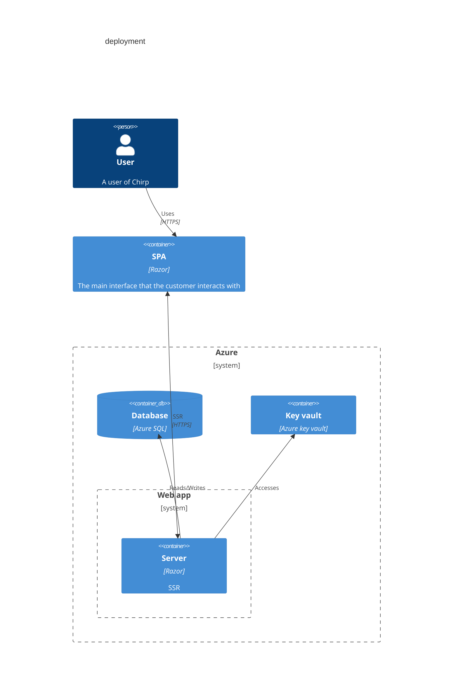

### Razor
In this digram I have taken into consideration that Razor utilizes server side rendering, which means that it generates javascript and html from the code written and sends that to the user. This means for our diagram that each user gets a page with some javascript, which can send HTTP requests to our server when the user want to interact with our application.
### Database
The database consists of a Azure SQL database which is, MsSQL but in the cloud. There are also other choices for a managed databases like Azure Cosmos DB, Firebase, Cloud SQL(google), Amazon RDS... and many more. Though there are problems with not using Azure SQL, which include
1. Not all offer a relational model.
2. It is easier to not spread your service providers.
3. Azure offers free credits on a student subscription.
4. GDPR wise it is better to use Azure or AWS since they can guarantee data to be stored in EU. See [Azure](https://azure.microsoft.com/en-us/explore/global-infrastructure/data-residency/#select-geography) and [AWS](https://aws.amazon.com/compliance/eu-data-protection/).
    - It should be noted that industry standards *(Atleast in Denmark)* seem to tend towards Azure, since they are more trusted.
### Key vault
We needed a way to get the connection to our database and that can quickly become problematic since a connection string should **NOT** be placed
- in the code
- anywhere in the github repository

___

So what do we do? Well there are two options, either use an environment variable or something even more resiliant. 

Putting the connection string in an environment variable places us at two kinds of risks.
1. Security
    - If a hacker gets access to the running application *(Which is run inside a container)* they would also be able to get into our database.
2. Internally vulnurable
    - Everyone who gets access to the web app also has the connection string.

___

These are prevented when using an Azure key vault, since you can manage access more easily and safely. Thus preventing the biggest security risk which is social engineering and phising, as less total user has access to the resource.